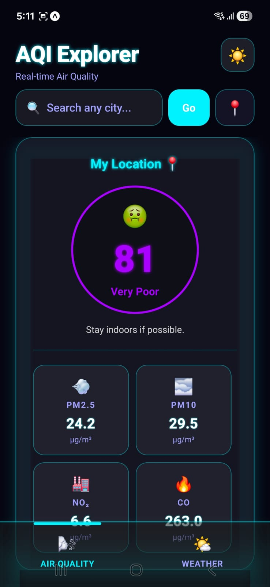
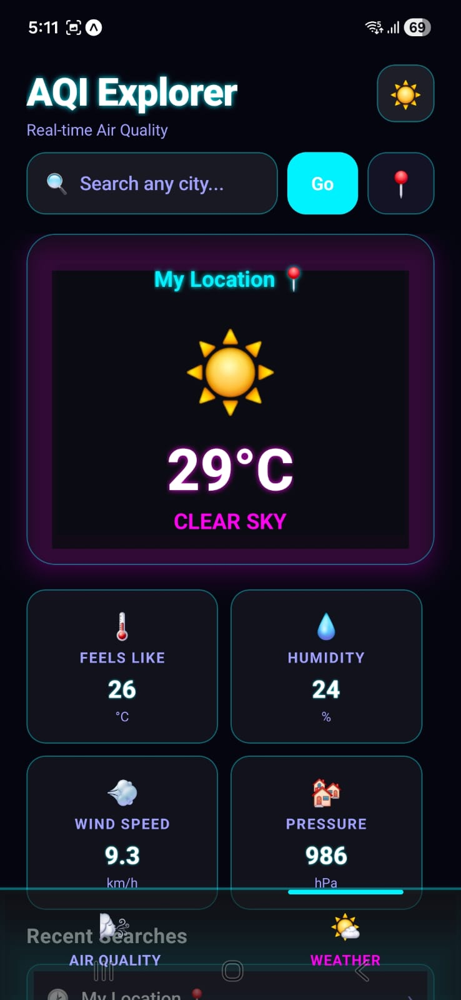
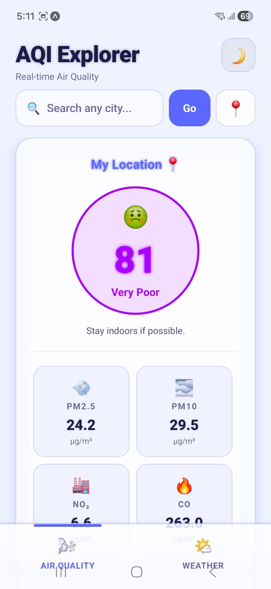

# 🌬️ AQI Explorer - React Native Expo App

A premium, cross-platform React Native utility application that lets users monitor real-time air quality indices (AQI) and weather conditions anywhere in the world. Built with **Expo** and enhanced with a **Glassy Neon UI**, featuring haptic feedback, local push notifications, and rich environmental data from the Open-Meteo API.

---

## 📸 Screenshots

| Air Quality (Dark) | Weather (Dark) | Air Quality (Light) | Weather (Light) |
|:---:|:---:|:---:|:---:|
|  |  |  |  |

---

## ✨ Key Features

### � Next-Gen Glassmorphism UI
Experience a professional, high-end interface built with `expo-blur`. The app features **frosted glass containers** and **neon glow highlights** that respond to your theme, making it feel like a futuristic dashboard in the palm of your hand.

### 📑 Unified Environmental Dashboard
Why settle for one? Our **Floating Dual-Tab System** lets you glide between two powerhouse views:
- **🌬️ Air Quality Hub:** A deep dive into atmospheric health with pulsing visual indicators.
- **🌤️ Weather Insight:** Real-time metrics including *Feels Like* temp, *Humidity*, *Pressure*, and *Wind Velocity*.

### 🎨 Immersive Themes
Choose your vibe with our custom-engineered search-persisted themes:
- **🌃 Neon Cyberpunk:** Deep blacks paired with electric cyan and magenta glows.
- **🌤️ Vibrant Pastel:** A hyper-clean, professional light mode featuring soft indigo and coral accents.

### 🎯 Precision & Interaction
- **🌍 Global Intelligence:** Search any city on Earth with instant geocoding and real-time environmental syncing.
- **� Instant Local Lock:** One-tap GPS synchronization to get the air quality of your immediate surroundings.
- **📳 Tactile Response:** Integrated `Haptic Feedback` makes every interaction feel physical and responsive.
- **🚨 Smart Alerts:** Automated local notifications keep you safe when air quality crosses into hazardous territory.

### 📊 Scientific Detail
Don't just see a number; understand it. Track **PM2.5, PM10, NO₂, and CO** levels with a scrollable **24-Hour Forecast** to plan your day with confidence.

---

## 🛠️ Required Tech Stack

- **React Native / Expo SDK (v54+)**
- **UI & Animations:**
  - `expo-blur` (Glassmorphism effects)
  - `expo-linear-gradient`
  - `Animated` API (Pulsing indicators)
- **API:**
  - [Open-Meteo Air Quality & Weather API](https://open-meteo.com/)
- **Expo Native Modules:**
  - `expo-location`
  - `expo-notifications`
  - `expo-haptics`
  - `@react-native-async-storage/async-storage`

---

## 🚀 Getting Started

### 1. Prerequisites
Make sure you have Node.js installed, and install the **Expo Go** application on your device.

### 2. Installations
```bash
# Clone the repository
git clone https://github.com/anurag375/AirAlert.git
cd AirAlert

# Install dependencies
npm install
```

### 3. Running the App
```bash
npx expo start
```
Scan the QR code with **Expo Go** (Android) or the **Camera App** (iOS).

---

## ⚠️ Known Limitations
- **Background Tasks:** Notifications trigger when the app is active or upon manual fetch; background fetch is not implemented in this version.
- **Expo Go:** Local notifications are used to ensure maximum compatibility without needing a full development build.

---

*Made for the Clash of Coders Hackathon 2026*
